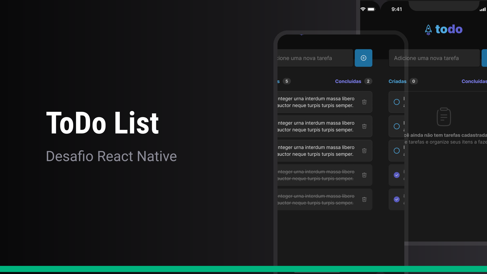

<h1 align="center">
   
</h1> 

<div align="center">
  <b>
    <a href="#-Technologies"><b>Technologies</b></a>&nbsp;&nbsp;&nbsp;|&nbsp;&nbsp;&nbsp;
    <a href="#-Project"><b>Project</b></a>&nbsp;&nbsp;&nbsp;|&nbsp;&nbsp;&nbsp;
    <a href="#-Layout"><b>Layout</b></a>&nbsp;&nbsp;&nbsp;
  </b>  
</div>

---

<div align="center">
  
</div> 

</br>

## 🚀 Getting started

Clone the project and access the folder.

```bash
$ git clone https://github.com/diaspd/to-do-mobile.git

# Install the dependencies
$ npm install

# Start the application
$ npm run start

```
</br>

## 💻 Technologies

This project was developed with the following technologies:
<b>
- React Native
- Expo
- TypeScript
</b>

</br>

## 📄 Project
💰 .

<br></br>

## 🔖 Layout
- [To Do - Figma](https://www.figma.com/file/DjZQT6nSUiA3i2GcHeO4Y6/ToDo-List-%E2%80%A2-Desafio-React-Native-(Copy)?type=design&mode=design&t=IFefr42yg8ViYYDG-0)

<br></br>

Made with ♥ by Pedro Dias. 👋 Follow me on social media! </br>

If you can give a little star, I appreciate it 🤩
